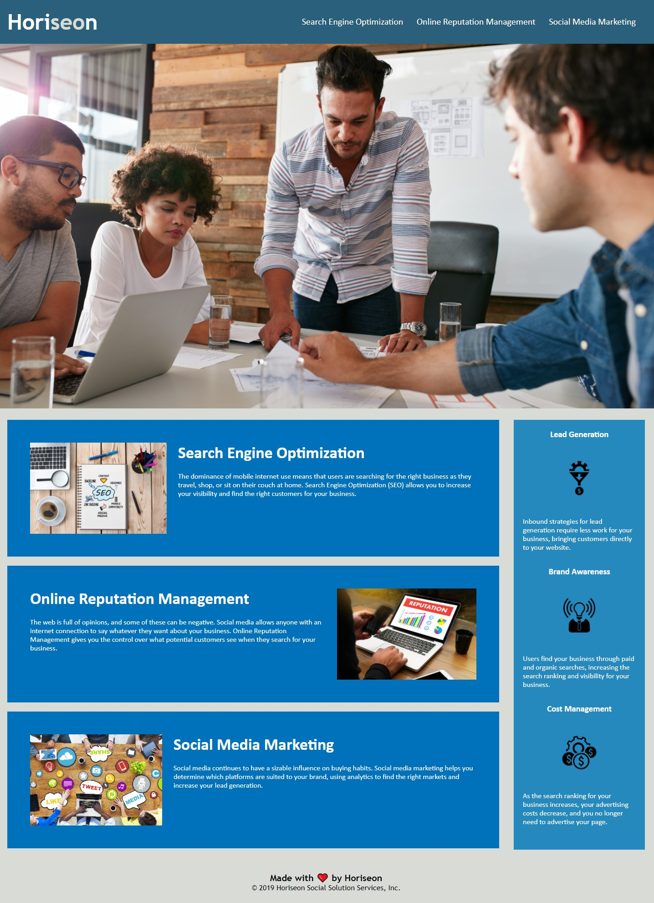

# Horiseon Social Solutions
## Project
This project was practice for refactoring HTML and CSS as well as getting used to Git and GitHub in a controlled enviroment. The idea was to cleanup the code where HTML was cleaned up and `div` elements were replaced for their semantic counterparts to increase accessibility and SEO potential. CSS was then commented and consolidated to reduce repeating code and give a generally cleaner look.

## Challenges and Lessons Learned
Getting used to working with someone elses code was initally a challange as I first had to familiarize myself with how the site was structured in both HTML and CSS before I could get into refactoring. From there it was fairly simple to refactor the HTML, however the CSS was a bit more challenging as there aren't many set in stone guidelines for organizing CSS leading to me organizing it in a way that I found to be better for figuring out where elements of the CSS were sorted.

## Site
You can find the deployed site at: https://nikolasmazur.github.io/horiseon-social-solutions/.
After hosting on GitHub Pages the site should look like this:

